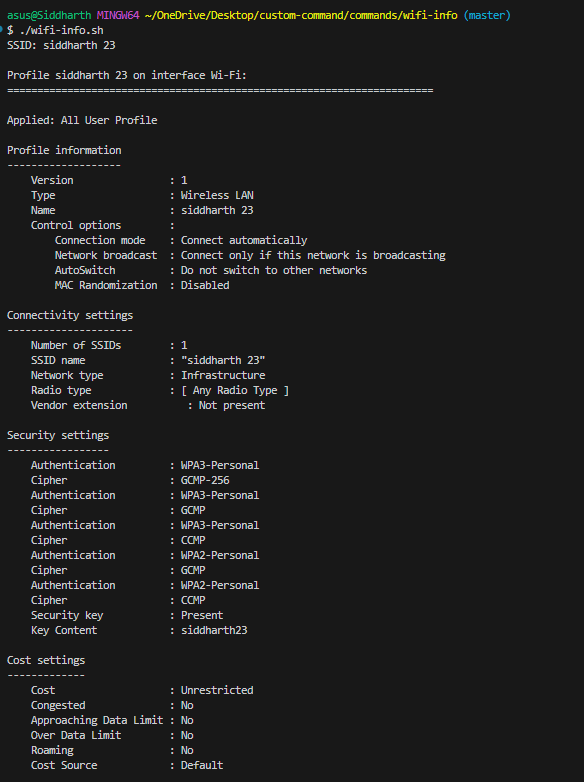

# wifi-info.sh

**Reveal Wi‑Fi password for the currently connected SSID**

`wifi-info.sh` (formerly `wifi-pass.sh`) is a small cross‑platform Bash helper that attempts to detect the active Wi‑Fi SSID and print the saved password/PSK for that network. It supports macOS, major Linux desktop environments using NetworkManager or wpa_supplicant, and Windows (via `netsh` when run in Git Bash / MSYS).

---

> ⚠️ **Important — use responsibly.** This script is intended only for retrieving passwords on networks you own or where you have explicit permission to access the password. Do **not** use it to access or share other people's networks without consent.

---

## Features

* Auto-detects current SSID on macOS, Linux and Windows (Git Bash).
* Prints the saved Wi‑Fi password (may prompt for elevated privileges or macOS Keychain permission).
* Uses multiple fallbacks on Linux (nmcli secrets, NetworkManager connection files, wpa_supplicant).
* Clear error messages when SSID or password cannot be found.

---

## Requirements

* Bash shell.
* Platform-specific utilities:

  * **macOS:** `airport` (bundled) and `security` (Keychain access).
  * **Linux:** `nmcli` (NetworkManager) and/or access to `/etc/NetworkManager/system-connections/` and `/etc/wpa_supplicant/wpa_supplicant.conf` (root may be required).
  * **Windows (Git Bash):** `netsh` (available in Windows) when running inside Git Bash / MSYS.
* You may need `sudo` on Linux to read connection files or query secrets.

---

## Installation

1. Save the script to your machine:

```bash
wget -O wifi-info.sh https://path-to-your-script/wifi-info.sh
```

2. Make it executable:

```bash
chmod +x wifi-info.sh
```

3. (Optional) Move into your PATH for global use:

```bash
sudo mv wifi-info.sh /usr/local/bin/wifi-info
```

---

## Usage

### Basic

```bash
./wifi-info.sh
```

The script will:

* Detect the OS.
* Try to find the currently connected SSID.
* Print the SSID and attempt to display the saved password.

### Example outputs

**macOS** (may trigger Keychain prompt):

```
SSID: HomeNetwork
my-secret-password
```

**Linux (NetworkManager, needs sudo for secrets):**

```
SSID: OfficeNet
supersecurepsk
```

**Linux fallback (wpa_supplicant):**

```
psk="anotherpassword"
```

**Windows (Git Bash using netsh):**

```
SSID: MyWifi
    Key Content : visiblepassword
```

### Screenshot



---

## Troubleshooting

* If the script prints "Could not detect SSID.", ensure you are actually connected to Wi‑Fi and that the platform-specific tools are present (e.g., `nmcli` on Linux).
* On macOS the `security` command will often prompt for permission to access the Keychain entry.
* On Linux, retrieving secrets may require `sudo` or root access because connection files are protected.
* Some distributions or connection managers store passwords in system keyrings (e.g., GNOME Keyring) that `nmcli` cannot read without the appropriate session unlocked.

---

## Security & Privacy

* The script prints sensitive information to stdout — avoid running it in shared terminals or piping output to untrusted processes.
* Do not commit this script or its output to public repositories if it reveals real passwords.
* Consider removing or redacting passwords before sharing logs.

---

## License

MIT License — use, modify, and share responsibly.
